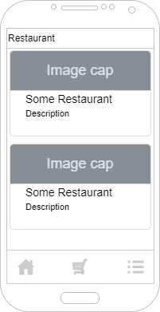
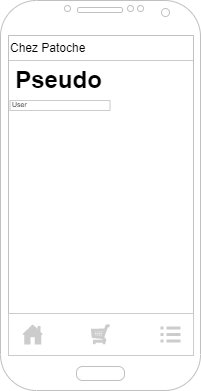

[](https://codefirst.iut.uca.fr/React-if/React-eat)

[](https://codefirst.iut.uca.fr/sonar/dashboard?id=React-eat)
[](https://codefirst.iut.uca.fr/sonar/dashboard?id=React-eat)
[](https://codefirst.iut.uca.fr/sonar/dashboard?id=React-eat)

[](https://codefirst.iut.uca.fr/sonar/dashboard?id=React-eat)
[](https://codefirst.iut.uca.fr/sonar/dashboard?id=React-eat)

[](https://codefirst.iut.uca.fr/sonar/dashboard?id=React-eat)
[](https://codefirst.iut.uca.fr/sonar/dashboard?id=React-eat)
[](https://codefirst.iut.uca.fr/sonar/dashboard?id=React-eat)
[](https://codefirst.iut.uca.fr/sonar/dashboard?id=React-eat)
[](https://codefirst.iut.uca.fr/sonar/dashboard?id=React-eat)
[](https://codefirst.iut.uca.fr/sonar/dashboard?id=React-eat)

# React-eat

## Install

In the ``Sources`` directory, execute following commands to install and launch the expo server.
```shell
npm install
npm start
```

## 📝 Purpose

React-Eat is another application to order some foods on your mobile. You can see restaurants, add their articles in your basket and manage articles of your basket. In the ``Settings`` screen, you can edit your nickname.

## 🛠 Languages & tools


## 🖊️ Versions 

- [React Native](https://reactnative.dev/): 0.7

## ⚙️ Architecture

### Navigation

The first component of the app is a Bottom Bar Navigation, that allow to navigate between Home, Basket and Settings. In the ``Home`` page, there is an other navigation, with Stack Navigation. So when you click on a restaurant, the app navigate to its details. Nest Stack navigation in the Bottom Bar navigation allow the user to go on a details of a restaurant, keeping access to other tab.

### Redux

Restaurant list, basket and the nickname are stored with redux.

### AsyncStorage

Basket is stored in AsyncStorage, to be saved closind the app and opening later.

## 📍 Sketchs

| Home | Details |
| --- | --- |
|  |  |

| Basket | Settings |
| --- | --- |
|  |  |

## ✍️ Credits

* Co-author [Mathis Ribémont](https://github.com/TEDDAC)
* Co-author [Valentin Clergue](https://github.com/HandyS11)